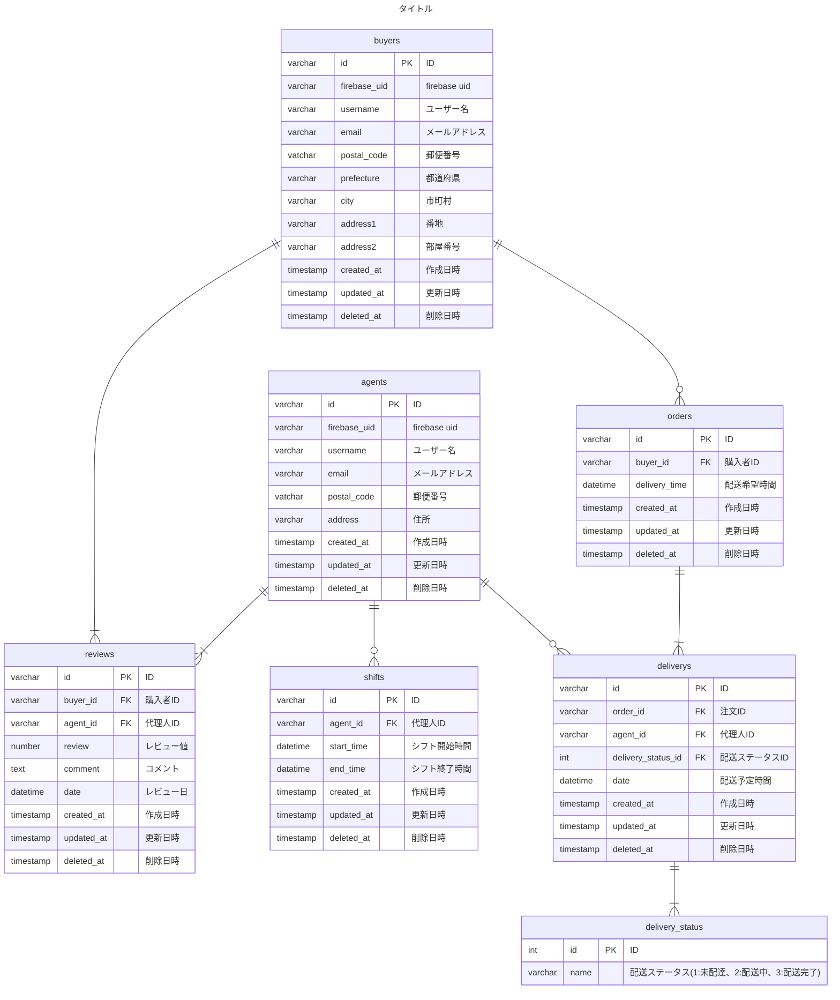

# ER 図

DeliDeV のデータベース設計（Ver.2.0.0：2023/10/05）

## データベース

```mermaid
---
title: "タイトル"
---
erDiagram
    buyers ||--|{ reviews : ""
    buyers ||--o{ orders : ""

    agents ||--|{ reviews : ""
    agents ||--o{ shifts : ""
    agents ||--o{ deliverys : ""

    orders ||--|{ deliverys : ""

    deliverys ||--|{ delivery_status : ""

    buyers {
      varchar id PK "ID"
      varchar firebase_uid "firebase uid"
      varchar username "ユーザー名"
      varchar email "メールアドレス"
      vatchar postal_code "郵便番号"
      varchar prefecture "都道府県"
      varchar city "市町村"
      varchar address1 "番地"
      varchar address2 "部屋番号"
      timestamp created_at "作成日時"
      timestamp updated_at "更新日時"
      timestamp deleted_at "削除日時"
    }

    agents {
      varchar id PK "ID"
      varchar firebase_uid "firebase uid"
      varchar username "ユーザー名"
      varchar email "メールアドレス"
      vatchar postal_code "郵便番号"
      varchar address "住所"
      timestamp created_at "作成日時"
      timestamp updated_at "更新日時"
      timestamp deleted_at "削除日時"
    }

    orders {
      varchar id PK "ID"
      varchar buyer_id FK "購入者ID"
      datetime delivery_time "配送希望時間"
      timestamp created_at "作成日時"
      timestamp updated_at "更新日時"
      timestamp deleted_at "削除日時"
    }

    reviews {
      varchar id PK "ID"
      varchar buyer_id FK "購入者ID"
      varchar agent_id FK "代理人ID"
      number review "レビュー値"
      text comment "コメント"
      datetime date "レビュー日"
      timestamp created_at "作成日時"
      timestamp updated_at "更新日時"
      timestamp deleted_at "削除日時"
    }

    shifts {
      varchar id PK "ID"
      varchar agent_id FK "代理人ID"
      datetime start_time "シフト開始時間"
      datatime end_time "シフト終了時間"
      timestamp created_at "作成日時"
      timestamp updated_at "更新日時"
      timestamp deleted_at "削除日時"
    }

    deliverys {
      varchar id PK "ID"
      varchar order_id FK "注文ID"
      varchar agent_id FK "代理人ID"
      int delivery_status_id FK "配送ステータスID"
      datetime date "配送予定時間"
      timestamp created_at "作成日時"
      timestamp updated_at "更新日時"
      timestamp deleted_at "削除日時"
    }

    delivery_status {
      int id PK "ID"
      varchar name "配送ステータス(1:未配達、2:配送中、3:配送完了)"
    }
```
